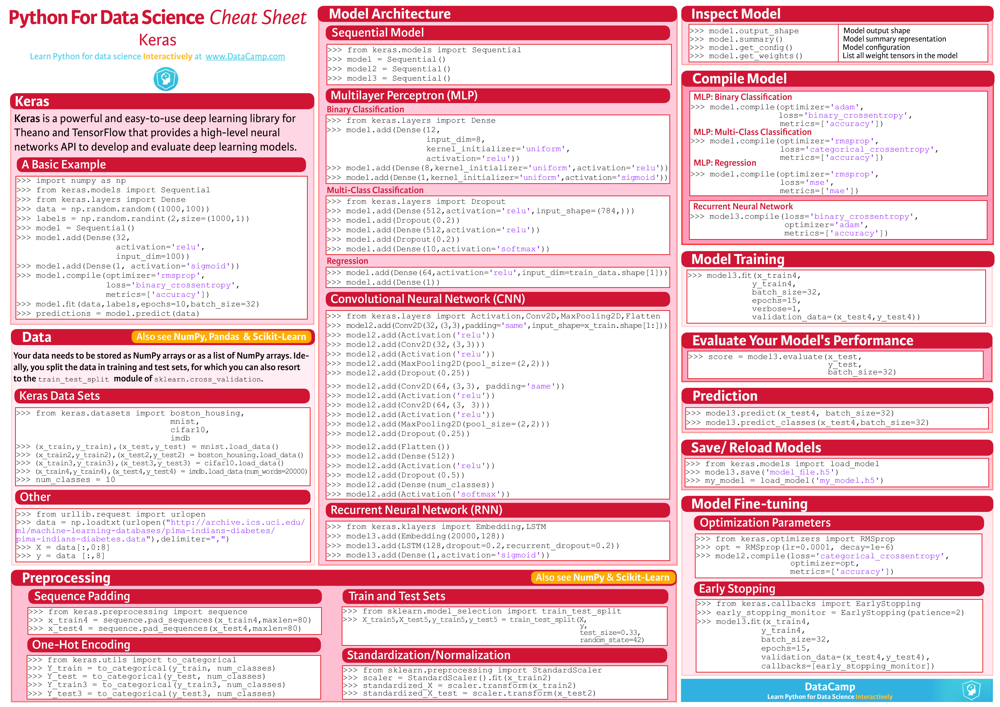
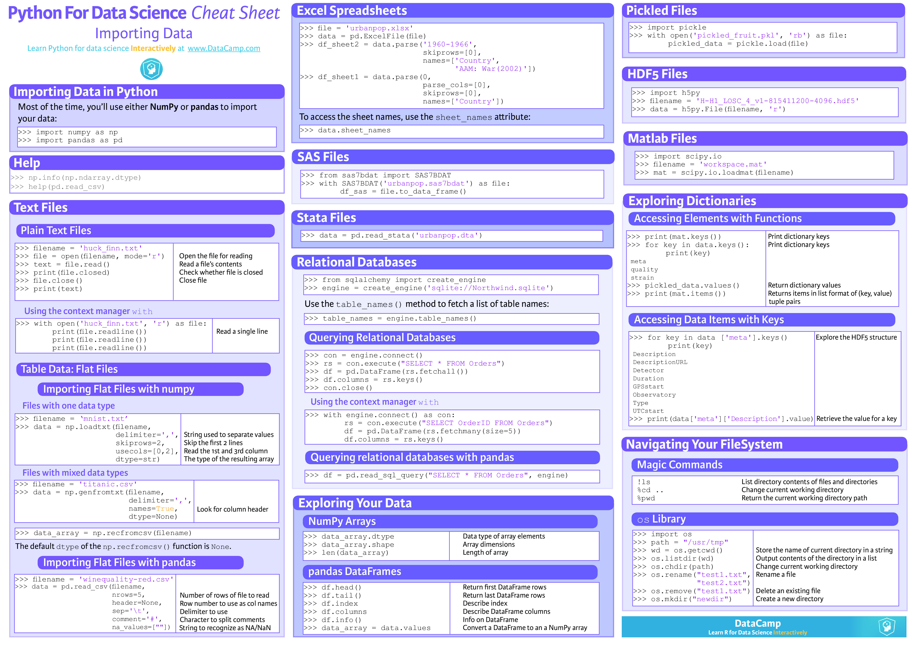

# 10 Days For CNN





## Rules 

- Everyday 1 neuro network no matter what.

## Links

- [Best practical course ever](https://rutracker.org/forum/viewtopic.php?t=5872308)
- [Best book from course](https://nnmclub.to/forum/viewtopic.php?t=1476203)
- [PyImage Search I recomend as pair start point](https://www.pyimagesearch.com/)

## DataSources

```py
tf.keras.datasets.
```

`boston_housing` module: Public API for tf.keras.datasets.boston_housing namespace.

`cifar10`	module: Public API for tf.keras.datasets.cifar10 namespace.

`cifar100`	module: Public API for tf.keras.datasets.cifar100 namespace.

`fashion_mnist`	module: Public API for tf.keras.datasets.fashion_mnist namespace.

`imdb`		module: Public API for tf.keras.datasets.imdb namespace.

`mnist`	 	module: Public API for tf.keras.datasets.mnist namespace.

`reuters`	module: Public API for tf.keras.datasets.reuters namespace.


- Day 0 Practical Use
- Day 1 Simple Use cases


## Day 0 

###  todo

- TensorFlow official web page
- Jupyter notebooks
- Course I recomended from rutracker
- Keggle


## Day 1

### Form follow the shape

- Metrics:
	- Time
	- Countity 
	- Speed 
	- CNN per week
	- Easiest way possible

### Noted

`traing_images.shape`
>(6000,28,28)

#### Black and white plot

`plt.imshow(tri[i],cmap=plt.cm.binary)`


### Layers

[Layer Types](https://www.tensorflow.org/api_docs/python/tf/keras/layers)

- `Flatten`  - Matrix into array
- `Dense` - comapring data layer
- `Softmax` - Get total probability (typically last label)

### Optimizer

`model.compile(optimizer='adam',`
